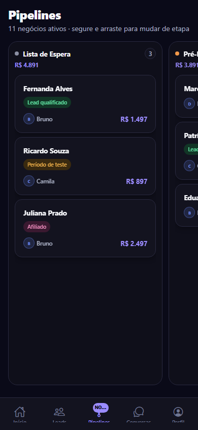
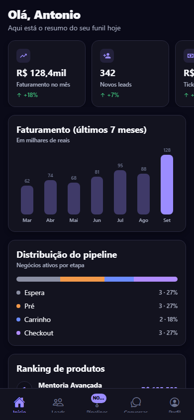
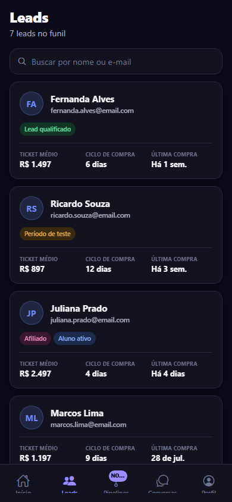

<div align="center">

<picture>
  <source media="(prefers-color-scheme: dark)" srcset="docs/brand/datacrazy-logo-dark.svg">
  
</picture>

<br /><br />

## CRM Mobile — Desafio Dev Mobile 2026

App mobile (React Native + Expo) com o Pipeline em Kanban que faltava na
versão publicada do CRM Datacrazy.

[](https://expo.dev)
[](https://reactnative.dev)
[](https://www.typescriptlang.org)

[Board do projeto](https://github.com/users/antoniocristovam/projects/1) ·
[Issues](https://github.com/antoniocristovam/crm-datacrazy/issues) ·

</div>

> ⚠️ **Projeto de teste/estudo.** Feito como resposta pessoal ao "Desafio Dev
> Mobile 2026" da Datacrazy — não é um produto oficial da empresa, não tem
> backend real (dados mockados) e não deve ser usado em produção. A logo é
> usada aqui só pra dar contexto ao desafio.

---

## Screenshots

<table>
  <tr>
    <td align="center" width="33%">
      <br />
      <sub><b>Pipelines</b> — drag-and-drop entre colunas</sub>
    </td>
    <td align="center" width="33%">
      <br />
      <sub><b>Início</b> — métricas e rankings</sub>
    </td>
    <td align="center" width="33%">
      <br />
      <sub><b>Leads</b> — ticket médio e ciclo de compra</sub>
    </td>
  </tr>
</table>

## O que tem no app

- **Pipeline em Kanban** (novidade) — colunas roláveis e cards arrastáveis
  entre etapas via `react-native-gesture-handler` + `react-native-reanimated`
  (gesto todo em worklets, sem travar a UI). Atualização otimista com
  rollback e toast em caso de erro — ver [`PipelineScreen.tsx`](./src/screens/PipelineScreen.tsx).
- **Dashboard** com métricas, gráfico de faturamento e ranking de
  produtos/atendentes.
- **Leads** com ticket médio, ciclo de compra e última compra.
- **Conversas** com indicador de fila offline (multiatendimento).
- **Perfil** com push notifications e Automações/Impulsos em modo leitura.

Tema escuro 100% vindo de [`src/theme.ts`](./src/theme.ts) — nenhuma cor
hardcoded nas telas.

## Stack

Expo SDK 57 · React Native 0.86 · TypeScript estrito · React Navigation
(bottom tabs) · react-native-reanimated/gesture-handler · expo-haptics.
Sem backend: dados mockados em [`src/data/mock.ts`](./src/data/mock.ts).

## Rodando localmente

Só precisa do app **Expo Go** no celular — nenhum módulo nativo customizado.

```bash
npm install
npm start
```

Aperte `a` (Android) ou `i` (iOS, macOS) no terminal do Metro, ou escaneie o
QR code com o Expo Go.

## Build nativa (Android/iOS) via EAS

```bash
npx eas-cli login
npx eas-cli build:configure
npx eas-cli build --platform android --profile preview   # APK de teste
npx eas-cli build --platform android --profile production
npx eas-cli build --platform ios --profile production
```

Perfis em [`eas.json`](./eas.json). Bundle id (`com.datacrazy.crm`) e ícones
em `assets/` são placeholders — trocar antes de qualquer publicação real.

## Roadmap

Backlog completo (épicos e fases) no
[GitHub Project](https://github.com/users/antoniocristovam/projects/1).
