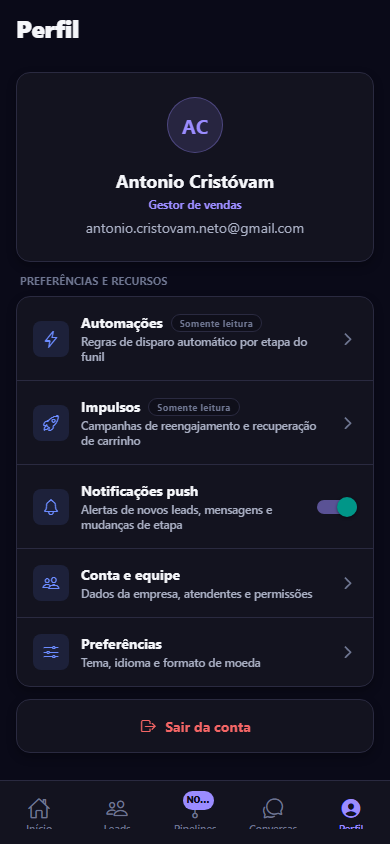

<div align="center">

<picture>
  <source media="(prefers-color-scheme: dark)" srcset="docs/brand/datacrazy-logo-dark.svg">
  
</picture>

<br /><br />

## CRM Mobile — Desafio Dev Mobile 2026

App mobile (React Native + Expo) desenvolvido em resposta ao **Desafio Dev
Mobile 2026** da Datacrazy: trazer a experiência de Pipeline em Kanban — hoje
só existe na versão web — para o app, e reduzir a distância entre o mobile e
o CRM web em métricas, leads e multiatendimento.

[](https://expo.dev)
[](https://reactnative.dev)
[](https://www.typescriptlang.org)
[](https://docs.swmansion.com/react-native-reanimated/)

[Board do projeto](https://github.com/users/antoniocristovam/projects/1) ·
[Issues](https://github.com/antoniocristovam/crm-datacrazy/issues) ·

</div>

---

## Screenshots

<table>
  <tr>
    <td align="center" width="33%">
      <br />
      <sub><b>Pipelines</b> — Kanban novo, drag-and-drop entre colunas</sub>
    </td>
    <td align="center" width="33%">
      <br />
      <sub><b>Início</b> — métricas, gráfico e rankings</sub>
    </td>
    <td align="center" width="33%">
      <br />
      <sub><b>Leads</b> — ticket médio, ciclo e última compra</sub>
    </td>
  </tr>
  <tr>
    <td align="center" width="33%">
      <br />
      <sub><b>Conversas</b> — multiatendimento com fila offline</sub>
    </td>
    <td align="center" width="33%">
      <br />
      <sub><b>Perfil</b> — push, Automações e Impulsos (leitura)</sub>
    </td>
    <td align="center" width="33%">
      <sub>Tema escuro aplicado a partir de<br /><code>src/theme.ts</code> em todas as telas.</sub>
    </td>
  </tr>
</table>

> Capturas tiradas do preview web do próprio app (`npm run web`) — o
> comportamento de arrastar os cards do Kanban só dá pra sentir de verdade no
> dispositivo (toque real), veja a seção [Rodando localmente](#rodando-localmente).

## Destaque: Pipeline em Kanban

A lacuna mais crítica identificada entre o app publicado e o CRM web — uso
diário direto do vendedor — não existia no mobile. Implementada em
[`PipelineScreen.tsx`](./src/screens/PipelineScreen.tsx):

- Colunas roláveis horizontalmente (~78% da largura da tela, com snap).
- Cards arrastáveis **entre colunas**, com `Gesture.Pan().activateAfterLongPress(150)`.
- Todo o gesto roda em **worklets** (`react-native-reanimated`) — posição do
  card fantasma e detecção de coluna sob o dedo não fazem round-trip para o
  JS thread a cada frame.
- Colunas medidas via `onLayout` + `measureInWindow`; o scroll (horizontal
  das colunas e vertical de cada coluna) fica travado durante o arraste para
  manter essas medições válidas.
- Ao soltar: atualização **otimista** do estado local e chamada a
  `updateDealStage` (mock em [`src/api/deals.ts`](./src/api/deals.ts),
  documentado para plugar o `PATCH /deals/{id}/stage` real). Se a chamada
  falhar, a mudança é revertida automaticamente com um toast de erro.

## Stack

- **Expo SDK 57** (React Native 0.86, React 19), TypeScript estrito.
- **React Navigation** (bottom tabs) — 5 abas: Início, Leads, Pipelines,
  Conversas, Perfil.
- **react-native-gesture-handler + react-native-reanimated** — drag-and-drop
  do Kanban.
- **expo-haptics** — feedback tátil ao pegar/soltar um card e no
  sucesso/erro da mudança de etapa.
- Sem backend real ainda: dados em [`src/data/mock.ts`](./src/data/mock.ts) e
  chamada de API do pipeline isolada em
  [`src/api/deals.ts`](./src/api/deals.ts).

## Estrutura

```
src/
  theme.ts            # fonte única de cores/espaçamento/tipografia (não hardcodar hex)
  types/models.ts      # tipos de domínio (Deal, Lead, Conversation, ...)
  data/mock.ts          # dados mockados usados pelas telas
  api/deals.ts          # chamada de API do pipeline (mock, pronta para integrar)
  utils/format.ts        # formatação de moeda (BRL), datas relativas, iniciais
  components/            # Screen, Card, Tag, Avatar, StatCard, BarChart, SegmentedBar, Toast
  navigation/
    RootNavigator.tsx    # bottom tabs + tema escuro + deep linking
    types.ts
  screens/
    HomeScreen.tsx        # Dashboard: 5 métricas + 2 gráficos + rankings
    LeadsScreen.tsx        # Lista de leads com ticket médio, ciclo e última compra
    PipelineScreen.tsx      # Kanban arrastável (aba "Pipelines", nova)
    ConversationsScreen.tsx  # Multiatendimento com indicador de fila offline
    ProfileScreen.tsx         # Perfil + Automações/Impulsos (somente leitura) + push
docs/
  brand/                  # logo oficial Datacrazy (claro/escuro)
  screenshots/             # capturas usadas neste README
```

## Rodando localmente

Pré-requisitos: Node 20+, e o app **Expo Go** no celular (mais rápido para
testar) ou um simulador iOS (precisa de macOS + Xcode) / emulador Android
(Android Studio).

O projeto usa só bibliotecas compatíveis com o Expo Go (nenhum módulo nativo
customizado ainda) — não precisa de build nenhum para testar no dia a dia.

```bash
npm install
npm start
```

No terminal do Metro, aperte `a` (Android), `i` (iOS, só em macOS) ou escaneie
o QR code com o app **Expo Go**. Também dá pra rodar direto:

```bash
npm run android   # abre no emulador/dispositivo Android via Expo Go
npm run ios       # abre no simulador iOS via Expo Go (só em macOS)
npm run web       # preview rápido no navegador, útil para revisar layout
```

> Se em algum momento `npm run android`/`ios` reclamar de "No development
> build installed", é sinal de que alguma dependência instalada exige um
> dev client customizado (ex.: `expo-dev-client` ou um módulo nativo fora do
> Expo Go). Rode `npx expo start --go` para forçar o modo Expo Go, ou gere um
> development build com EAS (veja a seção abaixo).

## Build nativa (Android e iOS) via EAS

O projeto já tem [`eas.json`](./eas.json) com 2 perfis (`preview`,
`production`) para gerar builds instaláveis de verdade (fora do Expo Go).
Não é preciso instalar nada globalmente — dá pra usar `npx eas-cli` direto
(evita problemas de PATH no Windows quando um `npm install -g` não fica
visível no PowerShell):

```bash
npx eas-cli login
npx eas-cli build:configure   # vincula o projeto à sua conta Expo e grava o projectId em app.json
```

Se preferir instalar globalmente (aí os comandos viram só `eas ...`):

```bash
npm install -g eas-cli
```

Depois de instalar globalmente, feche e abra um novo terminal antes de
rodar `eas login` — o PowerShell só recarrega o PATH em uma sessão nova.

Depois disso (troque `eas` por `npx eas-cli` se não instalou globalmente):

```bash
# APK de teste interno (Android) — não precisa de conta de desenvolvedor
eas build --platform android --profile preview

# Build de produção para as lojas
eas build --platform android --profile production   # gera .aab para a Play Store
eas build --platform ios --profile production        # gera .ipa para a App Store (exige conta Apple Developer)

# Enviar direto para as lojas depois do build
eas submit --platform android
eas submit --platform ios
```

Notas:

- Build iOS não exige macOS local — a EAS compila na nuvem. Só é necessário
  Xcode local se for rodar/depurar via `npx expo run:ios` diretamente numa
  máquina Mac.
- Se mais pra frente o projeto precisar de um módulo nativo que o Expo Go não
  suporta, reinstale `expo-dev-client` (`npx expo install expo-dev-client`) e
  adicione de volta um perfil `development` (`developmentClient: true`) no
  `eas.json` para gerar um build de desenvolvimento instalável.
- `applicationId`/`bundleIdentifier` já configurados como `com.datacrazy.crm`
  em [`app.json`](./app.json); ajuste para o identificador real da Datacrazy
  antes de publicar nas lojas.
- Os ícones em `assets/` (fora da logo em `docs/brand/`) ainda são os
  placeholders padrão do template Expo — trocar por artes finais da marca
  antes de gerar o build de produção.

## Backlog e roadmap

O backlog completo (épicos, tarefas e fases) está organizado no
[GitHub Project](https://github.com/users/antoniocristovam/projects/1) e nas
[issues](https://github.com/antoniocristovam/crm-datacrazy/issues) do repo.
Resumo das próximas fases (ver [`context.md`](./context.md) para a
justificativa completa de cada prioridade):

1. Plugar API real de deals/leads/conversas no lugar dos mocks.
2. Multiatendimento offline "de verdade": fila persistida (ex.: SQLite/MMKV)
   - sync incremental + push via FCM/APNs (hoje `ConversationsScreen` só
     mostra o estado de sincronização).
3. Se o volume de cards por coluna crescer muito em produção, trocar a
   `ScrollView` de cada coluna do Kanban por `@shopify/flash-list`.
4. Automações e Impulsos: hoje são apenas entradas informativas
   "somente leitura" no Perfil — implementar as telas de fato.
